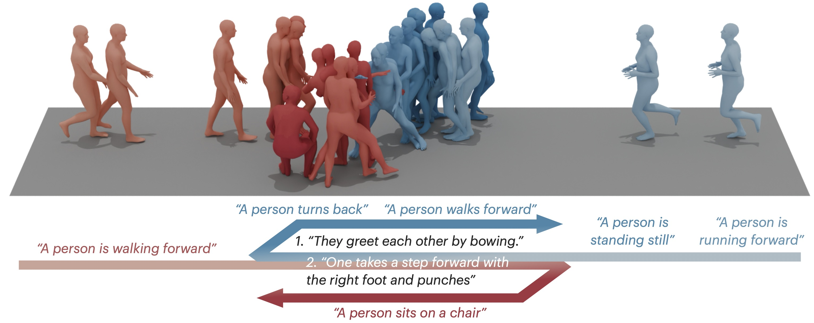

# ARMS: Anchor–Relational Motion Streaming for Seamless Solo-Social Motion Transitions

Code for our paper "ARMS: Anchor–Relational Motion Streaming for Seamless Solo-Social Motion Transitions"

<div align="center">



[](https://arxiv.org/abs/2607.05733)
[](https://hkliu.com/arms/)

</div>

## Getting Started

> Run all commands below from the repository root.

### Install the environment

```bash
uv sync
```

### Prepare the body models

The body-model files are distributed separately and are not included in this repository.
Download the **Extended SMPL+H model (used in AMASS)** from the [MANO/SMPL+H download page](https://mano.is.tue.mpg.de/download.php), and download SMPL-X from the [SMPL-X download page](https://smpl-x.is.tue.mpg.de/download.php). Follow the terms associated with each download.

Place the files used by ARMS as follows:

```text
dataset/smpl/
├── smplh/
│   ├── female/model.npz
│   ├── male/model.npz
│   └── neutral/model.npz
└── smplx/
    └── SMPLX_NEUTRAL.npz
```

The HumanML3D with-shape preprocessing selects the male or female SMPL-H model and supplies the AMASS shape coefficients (`betas`). HumanML3D without-shape and InterHuman without-shape use the neutral SMPL-H model with zero shape coefficients. InterX preprocessing uses the neutral SMPL-X model.

### Prepare the datasets

#### HumanML3D

ARMS uses the 30 FPS [272-dimensional HumanML3D representation](https://github.com/Li-xingXiao/272-dim-Motion-Representation) released with [MotionStreamer](https://github.com/zju3dv/MotionStreamer), rather than the standard 263-dimensional HumanML3D representation.
Download [`272-dim-HumanML3D`](https://huggingface.co/datasets/lxxiao/272-dim-HumanML3D) and extract `motion_data.zip` and `texts.zip`.

By default, [`dataset/humanml3d.py`](dataset/humanml3d.py) reads:

```text
humanml3d_272/motion_data/
AMASS/
```

The AMASS directory must contain the original `.npz` files in the paths referenced by `humanml3d.json`. Please follow the instruction of [`272-dim-HumanML3D`](https://huggingface.co/datasets/lxxiao/272-dim-HumanML3D) for details.

The HumanML3D directory:

```text
dataset/humanml3d_272/
├── mean_std/
│   ├── Mean.npy
│   └── Std.npy
├── split/
│   ├── train.txt
│   ├── val.txt
│   └── test.txt
└── texts/
```

The `mean_std`, `split`, and `texts` directories come from the HumanML3D-272 download. If AMASS or HumanML3D-272 is stored elsewhere, update `amass_dir` and `motion_dir` near the bottom of [`dataset/humanml3d.py`](dataset/humanml3d.py).

Process the HumanML3D with:

```bash
uv run python -m dataset.humanml3d
```

This produces:

```text
dataset/humanml3d_272/
├── motion_processed/                # gendered SMPL-H with betas
└── motion_processed without shape/  # neutral SMPL-H with zero betas
```

Both directories contain 262-dimensional (same as InterHuman) motions. The dataloaders convert them to the 266-dimensional ARMS representation at runtime.

#### InterHuman

Download InterHuman following the [InterGen data instructions](https://github.com/tr3e/InterGen?tab=readme-ov-file#2-get-data), then extract `motions_processed.zip`. Before running ARMS preprocessing, the directory should contain:

```text
dataset/InterHuman/
├── annots/
├── motions/                  # source .pkl files
├── motions_processed/
│   ├── person1/
│   └── person2/
├── split/
└── LICENSE.md
```

Generate the neutral, zero-shape version:

```bash
uv run python -m dataset.interhuman
```

The output is written to `dataset/InterHuman/motions_processed without shape/{person1,person2}/`.

#### InterX

Download InterX following the [Inter-X dataset instructions](https://github.com/liangxuy/Inter-X?tab=readme-ov-file#dataset-download) and the [InterMask data-preparation instructions](https://github.com/gohar-malik/intermask#3-get-data). Place the data under `dataset/InterX` (ARMS uses `InterX`, not the upstream `Inter-X_Dataset` directory name), and extract `processed/texts_processed.tar.gz`.

The preprocessing inputs required by ARMS are:

```text
dataset/InterX/
├── annots/
├── splits/
│   ├── train.txt
│   ├── val.txt
│   └── test.txt
├── processed/
│   ├── glove/
│   ├── texts_processed/
│   └── motions/
│       ├── train.h5
│       ├── val.h5
│       └── test.h5
└── text2motion/checkpoints/
```

Run:

```bash
uv run python -m dataset.interx
```

This creates `train_processed.h5`, `val_processed.h5`, and `test_processed.h5` beside the three input HDF5 files in `dataset/InterX/processed/motions/`. For the official InterX evaluator, copy the contents of `dataset/InterX/text2motion/checkpoints/` to `checkpoints/hhi/` as described by InterMask.

#### Expected local layout

After preprocessing, the relevant directories are:

```text
dataset/
├── humanml3d_272/
│   ├── humanml3d.json
│   ├── mean_std/
│   ├── motion_processed/
│   ├── motion_processed without shape/
│   ├── split/
│   └── texts/
├── InterHuman/
│   ├── annots/
│   ├── motions/
│   ├── motions_processed/
│   ├── motions_processed without shape/
│   └── split/
├── InterX/
│   ├── processed/
│   ├── splits/
│   └── text2motion/
├── mean_std/
└── smpl/
```

The current HumanML3D and InterHuman dataloaders read the canonical `motion_processed/` and `motions_processed/` directories, respectively. The corresponding `without shape` directories preserve the alternate data used by the without-shape experiment; there is currently no runtime flag that switches between them.

## Train models

> We provide the checkpoints. Download the released checkpoints into the directory layout expected by the training and evaluation configurations:
>
> ```bash
> uv run hf download kksix/arms --local-dir checkpoints
> ```

Training is performed in two stages: train the motion VAE first, then train the DiT with that VAE frozen.

The trainers start a Weights & Biases run when `log_level=INFO`; either log in first with `uv run wandb login` or run offline with:

```bash
export WANDB_MODE=offline
```

Each run creates `checkpoints/<exp_name>/config.yaml` and
`model/{latest,best}.pth`.

### Train the VAEs

Train the InterHuman VAE used by both InterHuman DiTs:

```bash
uv run python -m trainer.vae \
  exp_name=vae_with-shape
```

Train the InterX VAE:

```bash
uv run python -m trainer.vae \
  exp_name=vae_interx \
  trainer.dataset_module=InterXM2M \
  trainer.window_stride=10 \
  model.vae.input_width=470 \
  model.vae.mean_fpath=dataset/mean_std/mean_interx.npy \
  model.vae.std_fpath=dataset/mean_std/std_interx.npy
```

Train the HumanML3D VAE:

```bash
uv run python -m trainer.vae \
  exp_name=vae_hml3d \
  trainer.dataset_module=HumanML3DM2M \
  trainer.window_stride=5
```

For the without-shape ablation, first make the dataset classes load the alternate processed directories. In `HumanML3DM2M` and `HumanML3DT2M`, change the loader path `motion_processed` to `motion_processed without shape`. In `InterHumanM2M` and `InterHumanT2M`, change `motions_processed` to `motions_processed without shape`. Change only the loader paths, not the output paths in the preprocessing `__main__` blocks. Then run:

```bash
uv run python -m trainer.vae \
  exp_name=vae_without-shape \
  trainer.dataset_module=M2MDataset \
  model.vae.mean_fpath=dataset/mean_std/mean_without-shape.npy \
  model.vae.std_fpath=dataset/mean_std/std_without-shape.npy
```

### Train the DiTs

Train the full-window InterHuman model (`num_frame_per_block=0`):

```bash
uv run python -m trainer.dit \
  exp_name=dit_interhuman_full-window \
  model.vae.path=checkpoints/vae_with-shape
```

Train the block-streaming InterHuman model (`num_frame_per_block=5`):

```bash
uv run python -m trainer.dit \
  exp_name=dit_interhuman \
  model.vae.path=checkpoints/vae_with-shape \
  model.dit.num_frame_per_block=5
```

Train the InterX model:

```bash
uv run python -m trainer.dit \
  exp_name=dit_interx \
  model.vae.path=checkpoints/vae_interx \
  model.dit.max_length=40 \
  model.dit.num_frame_per_block=5 \
  trainer.dataset_module=InterXT2M \
  trainer.max_length=160 \
  trainer.forward_function=interx
```

Train the HumanML3D model:

```bash
uv run python -m trainer.dit \
  exp_name=dit_hml3d \
  model.vae.path=checkpoints/vae_hml3d \
  model.dit.num_frame_per_block=5 \
  trainer.dataset_module=HumanML3DT2M
```

Train the joint HumanML3D + InterHuman without-shape model while the alternate
loader paths described above are active:

```bash
uv run python -m trainer.dit \
  exp_name=dit_without-shape \
  model.vae.path=checkpoints/vae_without-shape \
  model.dit.num_frame_per_block=5 \
  trainer.dataset_module=T2MDataset
```

## Evaluate models

Evaluation requires the following evaluator checkpoints:

```text
checkpoints/
├── interclip.ckpt                         # InterHuman evaluator
├── epoch=99.ckpt                          # HumanML3D-272 evaluator
└── hhi/                                   # InterX evaluator
    ├── Comp_v6_KLD01/
    ├── Decomp_SP001_SM001_H512/
    ├── length_est_bigru/
    └── text_mot_match/
```

All results are written to a timestamped directory under
`evaluation_results/<exp_name>/`. The complete `evaluation_results/` directory
is ignored by Git and remains separate from checkpoint uploads.

### InterHuman

Evaluate full-window generation:

```bash
uv run python -m eval.eval \
  exp_name=dit_interhuman_full-window \
  dataset=interhuman \
  eval.scheduling_matrix_type=full_sequence
```

Evaluate streaming generation:

```bash
uv run python -m eval.eval \
  exp_name=dit_interhuman \
  dataset=interhuman
```

### InterX

Evaluate streaming generation:

```bash
uv run python -m eval.eval \
  exp_name=dit_interx \
  dataset=interx
```

### HumanML3D-272

Evaluate the single-person streaming model:

```bash
uv run python -m eval.eval_hml3d \
  exp_name=dit_hml3d
```

## Generate demos

The three transition demos use `dit_without-shape` by default.

```bash
uv run python -m demo.single_to_single
uv run python -m demo.single_to_double
uv run python -m demo.double_to_double
```

Each command writes `motion.npy`, `joints.npy` under `checkpoints/dit_without-shape/demo/<transition>/`.

Prompts, lengths, sampling settings, device, and output directory can be
overridden from the command line. For example:

```bash
uv run python -m demo.single_to_double \
  first_prompt="a person walks forward" \
  second_prompt="two people shake hands" \
  first_length=20 \
  second_length=30 \
  output_dir=output/single_to_double
```

Add `export_video=true` to render `demo.mp4`:

```bash
uv run python -m demo.single_to_double export_video=true
```

> Open3D is needed for visualization.

## Data, models, and redistribution
This repository contains ARMS code only.
Datasets, SMPL-family body models, and evaluator checkpoints have their own licenses and access terms and must be obtained from their respective sources.
Downloading or using the ARMS code does not grant rights to those external assets.

## Acknowledgments

Components in this code are derived from the following open-source efforts: [CMDM](https://github.com/YU1ut/CMDM), [InterGen](https://github.com/tr3e/InterGen), [Inter-X](https://github.com/liangxuy/Inter-X), [MotionStreamer](https://github.com/zju3dv/MotionStreamer), and [InterMask](https://github.com/gohar-malik/InterMask) projects.

We thank their authors for making their work available.

## Citation
If you find this code useful in your research, please cite:

```bibtex
@inproceedings{arms2026,
  title     = {ARMS: Anchor–Relational Motion Streaming for Seamless Solo-Social Motion Transitions},
  author    = {Liu, Huakun and Yu, Qing and Fujiwara, Kent and Uchiyama, Hideaki and Kiyokawa, Kiyoshi},
  booktitle = {European Conference on Computer Vision (ECCV)},
  year      = {2026}
}
```
